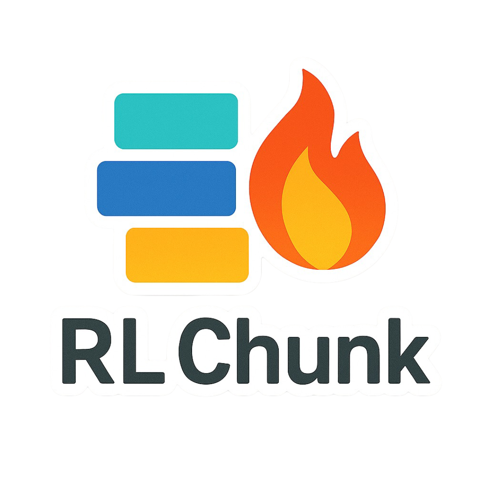

# 📚 Reinforcement Learning + LLM Pipeline for Chunk Selection and Response Generation

This repository contains a complete pipeline to train reinforcement learning agents for text chunk selection, apply large language models (LLMs) for response generation, and evaluate the quality of those responses using various metrics.

🧠 This project is model-agnostic — it works with any LLM to improve its results through smarter input selection.


---

## 🔧 Project Structure

```
.
├── 1-dataset-download.py
├── 2-dataset-cleaning.ipynb
├── 3-collecting-sample-dataset.ipynb
├── 4-rl-model-parallel-train.py
├── 5-rl-training-charts.ipynb
├── 6-generate-response-for-query-with-selected-chunks.py
├── 7-calculating-metrics-ragas-bert-bleu-rouge-cosine.ipynb
├── llmFunctions.py
├── RL_environment.py
└── README.md
```

---

## 📁 File Descriptions

### `1-dataset-download.py`

Downloads the **CRAG dataset** (split into parts), merges and extracts it, then converts all `.json/.jsonl` files to `.parquet`. It also combines them into a single file for easier processing.

---

### `2-dataset-cleaning.ipynb`

Cleans and filters the raw dataset into a more usable format, preparing it for reinforcement learning and LLM response tasks.

---

### `3-collecting-sample-dataset.ipynb`

Samples a subset of the dataset for per-query training (e.g., selecting 50 queries per domain). Produces a sampled `.parquet` file used in the RL training.

---

### `4-rl-model-parallel-train.py`

Trains reinforcement learning models (PPO, Recurrent PPO, DDPG, SAC) in parallel using multiple GPUs. Each model learns to select the most relevant chunks for a given query using a custom Gym environment (`FixedChunkEnvGranularReward`).

* Tracks emissions with [CodeCarbon](https://mlco2.github.io/codecarbon/)
* Uses `torch.multiprocessing` for parallelism
* Saves TensorBoard logs and trained model checkpoints

---

### `5-rl-training-charts.ipynb`

Visualizes training metrics and performance (e.g., episode rewards, loss curves) for RL models using the saved logs.

---

### `6-generate-response-for-query-with-selected-chunks.py`

Applies LLMs (Gemini or OpenAI-compatible) to generate responses for each query using the chunks selected (e.g., via BM25, FAISS, RL, or random). Can be parameterized for different selection strategies and models.

---

### `7-calculating-metrics-ragas-bert-bleu-rouge-cosine.ipynb`

Evaluates the quality of generated LLM responses using:

* RAGAs
* BERTScore
* BLEU
* ROUGE
* Cosine similarity

Also computes token usage.

---

### `llmFunctions.py`

Defines wrapper functions for generating and cleaning LLM responses using:

* **OpenAI-compatible models** (e.g., DeepSeek)
* **Google Vertex AI Gemini**

Includes:

* `get_response_from_llm`
* `get_response_from_llm_gemini`
* `clean_response`
* `clean_llm_response`

---

### `RL_environment.py`

Defines the custom Gym environment `FixedChunkEnvGranularReward`, which:

* Splits documents into chunks
* Rewards chunk selections based on similarity to the query
* Supports both discrete and continuous action spaces
* Implements a granular reward function

---

## 🧪 How to Run

### 1. Download and prepare the dataset

```bash
python 1-dataset-download.py
```

### 2. Clean and sample the dataset

Open and run:

* `2-dataset-cleaning.ipynb`
* `3-collecting-sample-dataset.ipynb`

### 3. Train RL models

```bash
python 4-rl-model-parallel-train.py
```

### 4. Visualize training

Open and run:

* `5-rl-training-charts.ipynb`

### 5. Generate LLM responses

Edit and run:

```bash
python 6-generate-response-for-query-with-selected-chunks.py
```

### 6. Evaluate response quality

Open and run:

* `7-calculating-metrics-ragas-bert-bleu-rouge-cosine.ipynb`

---

## 🧠 Dependencies

* `pandas`
* `tqdm`
* `torch`, `stable-baselines3`, `sb3-contrib`
* `gymnasium`, `spacy`
* `codecarbon`
* `pyarrow`
* `openai`, `vertexai`, `google-auth`
* `scikit-learn`, `evaluate`, `transformers`, etc.

Use a requirements file or environment manager (like `conda`) for reproducibility.

---

## ✅ Output Artifacts

* Trained RL models (`.zip`)
* TensorBoard logs
* Generated `.parquet` files with LLM responses
* Metric evaluation reports

---

## 📝 Notes

* You must configure your OpenAI or DeepSeek API keys and GCP credentials before running the LLM code.
* Make sure `en_core_web_md` (spaCy) is installed:

  ```bash
  python -m spacy download en_core_web_md
  ```

---

Let me know if you want this turned into a `requirements.txt`, `environment.yml`, or `Makefile` for easier automation!
