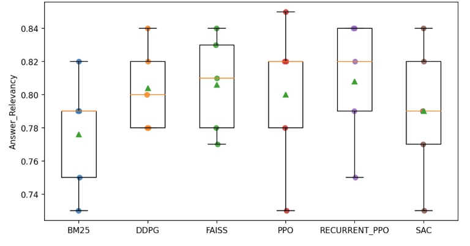
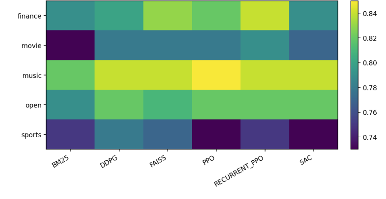
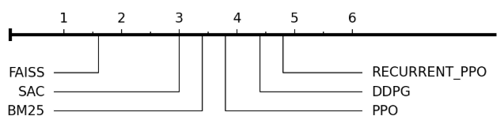
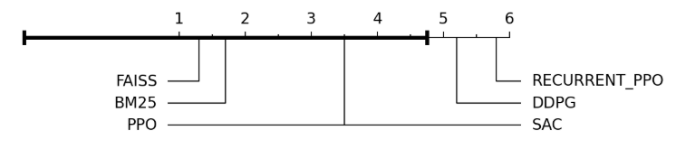

<hr>

# 📚 Reinforcement Learning + LLM Pipeline for Chunk Selection and Response Generation

This repository contains a complete pipeline to train reinforcement learning agents for text chunk selection, apply large language models (LLMs) for response generation, and evaluate the quality of those responses using various metrics.

🧠 This project is model-agnostic — it works with any LLM to improve its results through smarter input selection.

---

## 🔧 Project Structure

```text
.
├── 1-dataset-download.py
├── 2-dataset-cleaning.ipynb
├── 3-collecting-sample-dataset.ipynb
├── 4-rl-model-parallel-train.py
├── 5-rl-training-charts.ipynb
├── 6-generate-response-for-query-with-selected-chunks.py
├── 7-calculating-metrics-ragas-bert-bleu-rouge-cosine.ipynb
├── llmFunctions.py
├── RL_environment.py
└── README.md
```

---

## 📁 File Descriptions

### `1-dataset-download.py`

Downloads the **CRAG dataset** (split into parts), merges and extracts it, then converts all `.json/.jsonl` files to `.parquet`. It also combines them into a single file for easier processing.

---

### `2-dataset-cleaning.ipynb`

Cleans and filters the raw dataset into a more usable format, preparing it for reinforcement learning and LLM response tasks.

---

### `3-collecting-sample-dataset.ipynb`

Samples a subset of the dataset for per-query training (e.g., selecting 50 queries per domain). Produces a sampled `.parquet` file used in the RL training.

---

### `4-rl-model-parallel-train.py`

Trains reinforcement learning models (PPO, Recurrent PPO, DDPG, SAC) in parallel using multiple GPUs. Each model learns to select the most relevant chunks for a given query using a custom Gym environment (`FixedChunkEnvGranularReward`).

* Tracks emissions with [CodeCarbon](https://mlco2.github.io/codecarbon/)
* Uses `torch.multiprocessing` for parallelism
* Saves TensorBoard logs and trained model checkpoints

---

### `5-rl-training-charts.ipynb`

Visualizes training metrics and performance (e.g., episode rewards, loss curves) for RL models using the saved logs.

---

### `6-generate-response-for-query-with-selected-chunks.py`

Applies LLMs (Gemini or OpenAI-compatible) to generate responses for each query using the chunks selected (e.g., via BM25, FAISS, RL, or random). Can be parameterized for different selection strategies and models.

---

### `7-calculating-metrics-ragas-bert-bleu-rouge-cosine.ipynb`

Evaluates the quality of generated LLM responses using:

* RAGAs
* BERTScore
* BLEU
* ROUGE
* Cosine similarity

Also computes token usage.

---

### `llmFunctions.py`

Defines wrapper functions for generating and cleaning LLM responses using:

* **OpenAI-compatible models** (e.g., DeepSeek)
* **Google Vertex AI Gemini**

Includes:

* `get_response_from_llm`
* `get_response_from_llm_gemini`
* `clean_response`
* `clean_llm_response`

---

### `RL_environment.py`

Defines the custom Gym environment `FixedChunkEnvGranularReward`, which:

* Splits documents into chunks
* Rewards chunk selections based on similarity to the query
* Supports both discrete and continuous action spaces
* Implements a granular reward function

---

## 🧪 How to Run

### 1. Download and prepare the dataset

```bash
python 1-dataset-download.py
```

### 2. Clean and sample the dataset

Open and run:

* `2-dataset-cleaning.ipynb`
* `3-collecting-sample-dataset.ipynb`

### 3. Train RL models

```bash
python 4-rl-model-parallel-train.py
```

### 4. Visualize training

Open and run:

* `5-rl-training-charts.ipynb`

### 5. Generate LLM responses

Edit and run:

```bash
python 6-generate-response-for-query-with-selected-chunks.py
```

### 6. Evaluate response quality

Open and run:

* `7-calculating-metrics-ragas-bert-bleu-rouge-cosine.ipynb`

---

## 🧠 Dependencies

* `pandas`
* `tqdm`
* `torch`, `stable-baselines3`, `sb3-contrib`
* `gymnasium`, `spacy`
* `codecarbon`
* `pyarrow`
* `openai`, `vertexai`, `google-auth`
* `scikit-learn`, `evaluate`, `transformers`, etc.

Use a requirements file or environment manager (like `conda`) for reproducibility.

---

## ✅ Output Artifacts

* Trained RL models (`.zip`)
* TensorBoard logs
* Generated `.parquet` files with LLM responses
* Metric evaluation reports

---

## 📝 Notes

* You must configure your OpenAI or DeepSeek API keys and GCP credentials before running the LLM code.
* Make sure `en_core_web_md` (spaCy) is installed:

  ```bash
  python -m spacy download en_core_web_md
  ```

---

# 📎 Appendix: Additional Experimental Details

This appendix presents complementary statistical analyses, computational setup details, software dependencies, and hyperparameter configurations used in the experiments.

---

## Additional Statistical Analysis

This appendix presents complementary statistical analyses to further substantiate the empirical results reported in the main paper. Given the limited number of questions per CRAG domain (50 questions per domain) and the inherent stochasticity of reinforcement learning, we employ non-parametric tests, effect size measures, and distributional visualizations that are appropriate for small-sample, multi-dataset comparisons and do not assume normality.

Taken together, effect size analysis, distributional visualizations, and non-parametric significance testing provide complementary evidence for the robustness and practical impact of RL-Chunk. While the limited per-domain sample size motivates cautious interpretation, these analyses address concerns regarding variance and statistical reliability and support the conclusion that RL-Chunk offers a consistent and adaptive improvement over static retrieval baselines.

---

## Effect Size Analysis

In addition to reporting mean and standard deviation values, we compute effect sizes using Cohen’s $d$ to quantify the magnitude of performance differences between RL-Chunk and non-adaptive retrieval baselines. We focus on *Relevancy* and *Correctness*, as these are the most consistent and informative metrics achieved by RL-Chunk across domains, reflecting semantic alignment and factual accuracy of generated answers.

Cohen’s $d$ is computed from aggregated statistics as:

$$
d = \frac{\mu_{\text{RL}} - \mu_{\text{baseline}}}
{\sqrt{\frac{\sigma_{\text{RL}}^2 + \sigma_{\text{baseline}}^2}{2}}}.
$$

Tables below report effect sizes comparing the best-performing RL-Chunk variant against FAISS and BM25, respectively.

### Effect Size: RL-Chunk vs. FAISS

| Domain | Relevancy ($d$) | Correctness ($d$) |
|---|---:|---:|
| Finance | 0.00 | 0.50 |
| Movie | 0.00 | 0.44 |
| Open | 0.06 | 0.29 |
| Sports | 0.24 | 0.15 |
| Music | 0.11 | 0.07 |

### Effect Size: RL-Chunk vs. BM25

| Domain | Relevancy ($d$) | Correctness ($d$) |
|---|---:|---:|
| Finance | 0.36 | 0.53 |
| Movie | 0.29 | 0.19 |
| Open | 0.17 | 0.52 |
| Sports | 0.16 | 0.00 |
| Music | 0.22 | 0.13 |

Across domains, RL-Chunk exhibits small to moderate effect sizes, with more pronounced gains in correctness for Finance and Open domains. Smaller effect sizes in other domains reflect either strong baseline performance or increased domain-specific variability. While effect size analysis does not replace per-sample significance testing, it provides an estimate of practical significance that complements mean-based comparisons.

---

## Distributional Robustness Across Domains

To analyze robustness and variance across heterogeneous domains, the figure below presents boxplots of answer relevancy scores per method, where each point corresponds to a CRAG domain. Although not a formal significance test, this visualization highlights inter-domain variability, median performance, and overlap between methods. RL-Chunk variants consistently exhibit higher medians and reduced overlap with BM25, indicating that improvements are not driven by isolated domains.

<p align="center">
  
</p>

**Figure:** Boxplot of answer relevancy scores across retrieval methods, where each point corresponds to a CRAG domain. While not a formal statistical test, the visualization highlights inter-domain variability, median performance, and robustness across heterogeneous domains. RL-Chunk variants consistently exhibit higher medians and reduced overlap with BM25, supporting the effect size and non-parametric analyses reported in the appendix.

The heatmap below further illustrates domain-by-method performance patterns through answer relevancy. This visualization shows that different RL-Chunk variants perform well across diverse domains rather than relying on a single favorable setting, supporting the claim that the learned chunk selection policy adapts to varying retrieval conditions.

<p align="center">
  
</p>

**Figure:** Domain-by-method heatmap of answer relevancy scores across the CRAG domains. The visualization highlights systematic performance patterns and cross-domain consistency, showing that RL-Chunk variants adapt to heterogeneous retrieval conditions rather than relying on isolated domain-specific gains.

---

## Non-Parametric Significance Testing

To assess statistical significance across multiple methods and datasets, we conduct a Friedman test followed by a Nemenyi post-hoc analysis using average method rankings across the five CRAG domains. This non-parametric procedure is well-suited for comparing multiple algorithms over multiple datasets without assuming normality.

The following Critical Difference (CD) diagram shows the resulting comparison at $\alpha = 0.1$. Methods connected by a horizontal bar are not significantly different, while separated methods exhibit statistically significant differences. The diagram indicates that RL-Chunk variants consistently achieve higher average rankings than BM25 and FAISS, confirming that the observed gains are consistent across domains rather than driven by isolated cases.

<p align="center">
  
</p>

**Figure:** Critical Difference (CD) diagram obtained from a Friedman test followed by a Nemenyi post-hoc analysis across the five CRAG domains. Methods are ranked according to their average performance, with lower ranks indicating better performance. Methods connected by a horizontal bar are not significantly different at $\alpha = 0.1$. The diagram shows that RL-Chunk variants achieve consistently higher rankings than BM25 and FAISS, indicating statistically significant improvements across domains.

---

## Baseline-Focused Comparison

To provide a more conservative, baseline-centered analysis, we additionally perform a Bonferroni–Dunn post-hoc test using FAISS as the control method at $\alpha = 0.05$. The figure below shows that RL-Chunk variants achieve significantly better average rankings than the dense retrieval baseline under strict multiple-comparison correction. This analysis directly supports the claim that RL-Chunk yields statistically significant improvements over embedding-only retrieval across domains.

<p align="center">
  
</p>

**Figure:** Bonferroni–Dunn post-hoc test using FAISS as the control method across the five CRAG domains. Methods are ranked according to their average performance, with lower ranks indicating better performance. Methods whose rank difference exceeds the critical difference at $\alpha = 0.05$ are significantly different from the control. The diagram shows that RL-Chunk variants achieve statistically significant improvements over the FAISS baseline under a conservative multiple-comparison correction.

---

# Computational Setup

## Hardware Specifications

All experiments were conducted on a machine with the following configuration:

* **CPU:** 2× Intel Xeon Gold 6326 @ 2.90GHz (32 physical cores, 64 threads total)
* **GPU:** 4× NVIDIA A16 (16GiB each)
* **RAM:** 125GiB
* **Swap Memory:** 8GiB
* **Operating System:** Ubuntu 22.04 with kernel 5.15.0-144-generic
* **Virtualization:** VT-x supported

Detailed cache configuration includes L1d: 1.5MiB, L1i: 1MiB, L2: 40MiB, and L3: 48MiB. The system was NUMA, enabled with two memory nodes. All software packages and versions used in the experiments are listed in the project site: `https://anonymous.4open.science/r/RL-Chunk`, file `requirements.txt`.

---

## Software Dependencies

Major libraries and frameworks include:

* `bert-score==0.3.13`
* `codecarbon==3.0.1`
* `datasets==3.6.0`
* `gymnasium==1.1.1`
* `langchain-openai==0.3.24`
* `matplotlib==3.9.2`
* `nltk==3.9.1`
* `numpy==1.26.4`
* `openai==0.28.0`
* `pandarallel==1.6.5`
* `pandas==1.4.2`
* `pyarrow==16.1.0`
* `ragas==0.2.15`
* `requests==2.32.3`
* `rouge-score==0.1.2`
* `sb3-contrib==2.6.0`
* `scipy==1.12.0`
* `spacy==3.8.5`
* `stable-baselines3==2.6.0`
* `tensorflow==2.19.0`
* `torch==2.4.0+cu121`
* `tqdm==4.66.5`
* `vertexai==1.71.1`
* `beautifulsoup4`

---

# Hyperparameters

## Reinforcement Learning Algorithms

The table below outlines the main hyperparameter configurations used for each reinforcement learning algorithm evaluated in the study, including PPO, Recurrent PPO, DDPG, and SAC. Each method leverages distinct architectural and training choices, such as the use of LSTM in Recurrent PPO, experience replay buffers in DDPG and SAC, and generalized advantage estimation (GAE) in PPO variants.

| Parameter | PPO | Recurrent PPO | DDPG | SAC | Definition |
|---|---:|---:|---:|---:|---|
| Policy | MultiInput | MultiInputLstm | MultiInput | MultiInput | Neural network architecture used |
| Timesteps | 50000 | 50000 | 50000 | 50000 | Total number of training steps |
| $\alpha$ | 0.0003 | 0.0003 | 0.0001 | 0.0003 | Learning rate |
| $n_{\text{steps}}$ | 128 | 128 | 1 | 1 | Steps to run in each environment per update |
| $B$ | 64 | 128 | 256 | 256 | Minibatch size for updates |
| $n_{\text{epochs}}$ | 10 | 10 | N/A | N/A | Number of epochs for optimization |
| $\gamma$ | 0.99 | 0.99 | 0.99 | 0.99 | Discount factor |
| $\lambda$ | 0.95 | 0.95 | N/A | N/A | GAE (Generalized Advantage Estimation) lambda |
| $\epsilon$ | 0.2 | 0.2 | N/A | N/A | Clipping parameter for PPO |
| $c_{\text{ent}}$ | 0.0 | 0.0 | 0.0 | 0.0 | Entropy regularization coefficient |
| $c_{\text{vf}}$ | 0.5 | 0.5 | 0.5 | 0.5 | Value function loss coefficient |
| $\|\nabla\|_{\text{max}}$ | 0.5 | 0.5 | 0.5 | 1.0 | Gradient clipping norm |
| `stats_window_size` | 100 | 100 | 100 | 100 | Window size for averaging episode stats |
| `target_KL` | None | None | None | None | Target KL divergence (PPO) |
| `normalize_advantage` | TRUE | TRUE | N/A | N/A | Normalize advantage before learning |
| `buffer_size` | N/A | N/A | 1000000 | 1000000 | Replay buffer size |
| `learning_starts` | N/A | N/A | 100 | 100 | Timesteps before learning starts |
| $\tau$ | N/A | N/A | 0.005 | 0.005 | Soft update coefficient for target network |
| `train_freq` | N/A | N/A | 1 | 1 | Frequency of model training (env steps) |

---

## BM25 Configuration

The table below presents the BM25 scoring parameters used in the retrieval baseline. The $k_1$ parameter, set to 1.5, controls the saturation effect of term frequency, giving diminishing returns for repeated terms within a document. The length normalization parameter $b$ is set to 0.75, which partially adjusts the score based on the length of each text chunk — mitigating bias toward longer or shorter documents. Additionally, we include a minimum inverse document frequency threshold $\epsilon$ of 0.25 to prevent overly penalizing common terms. These parameter choices follow standard best practices for BM25 and were validated through preliminary experiments to ensure robust retrieval performance across domains.

| Parameter | Value |
|---|---:|
| $k_1$ | 1.5 |
| $b$ | 0.75 |
| $\epsilon$ | 0.25 |

---

## FAISS Configuration

The table below details the configuration used for dense retrieval with FAISS in the experiments. We employ the `all-MiniLM-L6-v2` model to generate 384-dimensional sentence embeddings, which are subsequently normalized to unit vectors to approximate cosine similarity via inner product. For efficient similarity search, we use the `IndexFlatIP` index from FAISS, which performs exact inner product computations. The retrieval strategy is based on top-$k$ nearest neighbor search using these similarity scores. This setup provides a strong and lightweight dense retrieval baseline suitable for real-time or large-scale applications.

| Component | Value |
|---|---|
| Embedding Model | `all-MiniLM-L6-v2` |
| Embedding Dimensionality | 384 |
| Normalization | Cosine approximation (unit vectors) |
| FAISS Index | `IndexFlatIP(384)` |
| Retrieval Strategy | Top-$k$ inner product similarity |

---

## LLM Configuration

The table below outlines the prompting configuration used for the large language model (LLM) in the experiments. We adopt the `gemini-2.0-flash` model, leveraging its extended 1 million token context window to handle long and complex inputs. The decoding parameters include a temperature of 1.0 and top-$p$ of 0.95, allowing for diverse yet coherent generations. The maximum number of output tokens is set to 8192, ensuring sufficient capacity for detailed responses.

| Parameter | Value |
|---|---|
| Model | `gemini-2.0-flash` |
| Context Window | 1M tokens |
| Temperature | 1.0 |
| Top-p | 0.95 |
| Max Output Tokens | 8192 |
